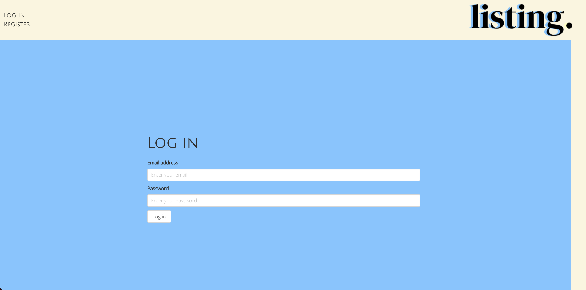

### General Assembly Software Engineering Immersive

# Project 4: Listing


## The Overview:

This was my final project at General Assembly, and I had the flexibility to build any kind web project. The main brief was for it to be a full stack app with a frontend consuming a backend API.

The backend needed to be a Python Flask API, and using this Flask REST Framework to serve my data from a Postgres database. This backend was then to be consumed using a frontend client built with React.

Being inspired by a real-life need for a purchase-tracking app (by my wonderful wife!), I decided to create Listing. This web-app allows you to create individual lists (or boards), and add products to them. I built a custom web-scraper which allows the user to simply provide the product page URL and it will scrape data from the pages' meta tags to improve the UX. Finally, the app also links to the product pages when the user is ready to purchase, and will track whether the purchase has been made.

You can check out the website here: [Listing](https://listingvvtm.herokuapp.com//)

We had the choice of working in groups for this project. However due to the personal nature of the design, and wanting to challenge myself, I opted to work solo on this.

### The Brief

We were given the below brief:

You must:

* **Build a full-stack application** by making your own backend and your own front-end
* **Use a Python Flask API** using a Flask REST Framework to serve your data from a Postgres database
* **Consume your API with a separate front-end** built with React
* **Be a complete product** which most likely means multiple relationships and CRUD functionality for at least a couple of models
* **Implement thoughtful user stories/wireframes** that are significant enough to help you know which features are core MVP and which you can cut
* **Have a visually impressive design** to kick your portfolio up a notch and have something to wow future clients & employers. **ALLOW** time for this.
* **Be deployed online** so it's publicly accessible.


Necessary deliverables are:

* A **working app** hosted on the internet
* A **link to your hosted working app** in the URL section of your Github repo
* A **git repository hosted on Github**, with a link to your hosted project, and frequent commits dating back to the _very beginning_ of the project
* **A `readme.md` file** with:
    * An embedded screenshot of the app
    * Explanations of the **technologies** used
    * A couple paragraphs about the **general approach you took**
    * **Installation instructions** for any dependencies
    * Link to your **user stories/wireframes** – sketches of major views / interfaces in your application, if applicable
    * Descriptions of any **unsolved problems** or **major hurdles** you had to overcome

    
### Technologies Used:

* HTML5
* CSS3
* ES6
* Git
* Github
* React.js
* Node.js
* Python
* Flask
* SQLAlchemy
* Marshmallow
* Postgres
* Psycopg2-binary
* Gazpacho
* Bulma
* Axios
* SASS/SCSS
* bcrypt
* jsonwebtoken
* Insomnia

### Planning:

The first step in planning was to map out the user story, and wireframe it out. This would serve as the foundation for the project and allowed me to build upon it.


From there I was able to think more about and design the relational database, and the models & relationships required. This was also drawn out on a whiteboard to serve as a point of reference.


Once both of these had been planned, I set out a list of major tasks/features that I wanted to aim for as an MVP, and as strech goals.


After the planning was complete, I opted to start with building the backend. This was due to the potential stumbling blocks I might encounter with the relationships, and I really wanted to accomplish some kind of scraper component. After that I would tackle the frontend client and styling.

Initially, I planned to style the app myself without any CSS frameworks as I had used Bulma for the previous two projects and I wanted to challenge myself futher. However, I was unable to as I became very ill midway through the project, and to save time when I recovered I opted to use the framework in which I was familiar with.

<b>NOTE:</b> Throughout the project, I've used two different names in the backend vs. the frontend for lists and items. On the frontend these specific names were used, however on the backend I used the names "boards" and "products" respectively. This was due to during planning, I used the backend names, however when designing the frontend I wanted to use names more aligned with the branding and so the names were changed.

## The Backend

Having rigourously planned the backend, I could follow the stucture while building it. 

I started with the models & relationships, and then in order to start testing the backend endpoints using Insomnia I built controllers and serialisers in order to access the models.

### Models & Relationships

Each model extended a simple base model with database columns for ID, and a created_by time, as well as a couple of methods:

```Python
class BaseModel:
    id = db.Column(db.Integer, primary_key=True)
    created_at = db.Column(db.DateTime, default=datetime.utcnow)

    def save(self):
        db.session.add(self)
        db.session.commit()

    def remove(self):
        db.session.delete(self)
        db.session.commit()
```

The most complex model was the user, as it contained data columns, validation, authentication, as well the widest variety of relationships (many-to-many, one-to-many, self-referential):

```Python
# password strength validation function
def validate_password_strength(password_plaintext):
    assert len(password_plaintext) >= 8, "Password too short"
    return { "messages": "Invalid password" }, 400


class User(db.Model, BaseModel):

    __tablename__ = 'users'
    # data columns
    username = db.Column(db.String(20), nullable=False, unique=True)
    email = db.Column(db.Text, nullable=False, unique=True)
    image = db.Column(db.Text, nullable=False, default='https://www.clipartkey.com/mpngs/m/152-1520367_user-profile-default-image-png-clipart-png-download.png')
    role = db.Column(db.Enum('normal', 'admin', name='access_types'), default='normal')
    password_hash = db.Column(db.String(128), nullable=True)

    # one-to-many relationships
    products = db.relationship('Product', backref='user')
    boards = db.relationship('Board', backref='user', cascade='all, delete')
    comments = db.relationship('Comment', backref='user')

    # self-referential one-to-many
    messages_sent = db.relationship('Message', backref='sender', lazy='dynamic', foreign_keys = 'Message.sender_id', cascade='all, delete')
    messages_received = db.relationship('Message', backref='recipient', lazy='dynamic', foreign_keys = 'Message.recipient_id', cascade='all, delete')
    
    # self-referential many-to-many
    following = db.relationship(
        'User', lambda: user_following,
        primaryjoin=lambda: User.id == user_following.c.user_id,
        secondaryjoin=lambda: User.id == user_following.c.following_id,
        backref='followers'
    )

    # password hasher
    @hybrid_property
    def password(self):
        pass
    @password.setter
    def password(self, password_plaintext):
        validate_password_strength(password_plaintext)
        encoded_pw = bcrypt.generate_password_hash(password_plaintext)
        self.password_hash = encoded_pw.decode('utf-8')

    # email validator
    @validates('email')
    def validate_email(self, key, address):
        assert '@' and '.' in address, "Invalid email"
        return address

    # password checker + token generator
    def validate_password(self, password_plaintext):
        return bcrypt.check_password_hash(self.password_hash, password_plaintext)

    def generate_token(self):
        payload = {
            "sub": self.id,
            "iat": datetime.utcnow(),
            "exp": datetime.utcnow() + timedelta(days=7),
        }
        token = jwt.encode(payload, secret, 'HS256')
        return token
```

Generally speaking, most relationships were simple to implement. Specifically the one-to-many relationships (e.g. users with boards they create). However, some relationships were much more complex.

Of these, the self-referential many-to-many relationship (following/followers) was one of the most challenging to implement. It required an additional join table in addition to the above code on the user model (with primary/secondary joins):

```Python
user_following = db.Table('user_following',
    db.Column('user_id', db.Integer, db.ForeignKey('users.id'), primary_key=True),
    db.Column('following_id', db.Integer, db.ForeignKey('users.id'), primary_key=True)
)
```

The most complex relationship to implement however was the many-to-many relationship between products and boards. A join table was not suitable for this, as I also needed to store a "purchased" boolean on the relationship (which would store whether that specific product on a given board was purchased). Therefore, I used a model to join the relationship between the two, which had the additional purchased column:

```Python
class Products_Boards(db.Model):
    _tablename__ = 'products_boards_join',
    product_id = db.Column(db.Integer, db.ForeignKey('products.id'), primary_key=True)
    board_id = db.Column(db.Integer, db.ForeignKey('boards.id'), primary_key=True)
    purchased = db.Column(db.Boolean, default=False)

    product = db.relationship('Product')
```

As the product was the side of the relationship which was "attached" or the "child" to the board, the product relationship was declared on this join model, while on the board model a relatinship was declared to the join model itself:

```Python
products = db.relationship('Products_Boards')
```

### Authentication

I created working authentication through the methods on the user model shown above. When creating a new user, the password hasher (password.setter) would (after validating password stregth) encode the users' password using bcrypt and store the hashed password on the user.

Methods on the model such as validate_password are called to validate the users' password when logging in, again using bcrypt. Finally the method generate_token would create a JSON web token (jwt) by taking the user's ID into the payload, and returning a token assigned to that user only.

The authenication methods can be seen on the below route on the user controller:

```Python
@router.route("/login", methods=["POST"])
def login():
    # look for user in database by filtering using email
    user = User.query.filter_by(email=request.json['email']).first()
    # if user does not exist, send appropriate message in response
    if not user:
        return { 'messages': 'No account found' }, 401
    # if password is incorrect, send appropriate message in response
    if not user.validate_password(request.json['password']):
        return { 'messages': 'Incorrect password' }, 401
    # if user exists and password matches, then generate jwt and send back in response
    token = user.generate_token()
    return { 'token': token, 'messages': f'Welcome back {user.username}!' }
```
The jwt would then be store in the browsers' local storage by the client. This is of course not the most secure method, and could be improved by using e.g. session-based cookies.

Finally, I was able to check if a user was logged in, and what their user ID is, within the client using the below function:

```Javascript
export function getLoggedInUserId() {
  // If no local storage, return false
  if (!localStorage) return false
  // Retrieve token
  const token = localStorage.getItem('token')
  // ! If no token, return false
  if (!token) return false
  // ! Extract payload from token, and convert into JSON object
  const payloadAsString = atob(token.split('.')[1])
  const payloadAsObject = JSON.parse(payloadAsString)
  // ! Return user ID within JSON object
  return payloadAsObject.sub
}
```

There is a second function which also quickly checks if the logged in user ID matches the user ID something on the page:

```Javascript
export function isCreator(userIdToCompare) {
  if (!userIdToCompare) return false
  return userIdToCompare === getLoggedInUserId()
}
```

### Controllers, Middleware and Serializers

Controllers were relatively straightforward to create, most of which were a matter of providing all or one of a certain type of data with simple error handling, with ID's provided from the client. E.g. boards: 

```Python
@router.route("/board", methods=["GET"])
@secure_route
def get_user_boards():
    boards = Board.query.filter_by(user_id=g.current_user.id)
    return board_schema.jsonify(boards, many=True), 200
    
@router.route("/board/<int:board_id>", methods=["GET"])
def get_single_board(board_id):
    board = Board.query.get(board_id)
    if not board: 
        return { 'messages': 'Board not found' }, 404
    return board_schema.jsonify(board), 200
```

More complicated controllers include marking a specific product as purchased (due to the more complicated relationship): 

```Python
@router.route("/product/<int:product_id>/board<int:board_id>", methods=["PUT"])
@secure_route
def mark_product_purchased(product_id, board_id):
    ## find board in boards table
    board = Board.query.get(board_id)
    if board.user != g.current_user:
        return { 'messages': 'Unauthorized' }, 401
    ## find product on products_boards join table
    product_to_toggle = Products_Boards.query.filter_by(product_id=product_id, board_id=board_id).first()
    if not product_to_toggle:
        return { "messages": "Product not on board" }, 400
    product_to_toggle.purchased = not product_to_toggle.purchased
    db.session.add(product_to_toggle)
    db.session.commit()
    return board_schema.jsonify(board), 200
```

Most controllers had the secure_route middleware wrapper function, which was important in that it checked whether a user was logged in, whether their token was expired, but also it would return the logged in user which could be used in each of the controllers.

```Python
def secure_route(func):
    # wrapper function
    @wraps(func)
    def wrapper(*args, **kwargs):
        # get token and clean
        token_with_bearer = request.headers.get('Authorization')
        token = token_with_bearer.replace("Bearer ", "")
        try: 
            # decode token & find token's user
            payload = jwt.decode(token, secret, 'HS256')
            user_id = payload['sub']
            user = User.query.get(user_id)
            if not user:
                return { "messages": "Unauthorized" }, 401
            g.current_user = user
        except jwt.ExpiredSignatureError: 
             # check if token is expired
             return { "messages": "Session timeout, please log in!" }, 401
        except Exception:
            # catch any errors due to authorization
            return { "messages": "Unauthorized" }, 401
        return func(*args, **kwargs)
    return wrapper
```

Other middleware include a simple logger (used in development), and an error handler which translated and returned useful responses for the most common errors.

Finally, a series of serializers of varying complexity were created using Marshmallow. These were important for the controllers as they created json objects which the controllers could read and also send as reponses.

Some models needed different types of serializer as in some cases less columns were required to be sent in reponses, e.g. user: 

```Python
#larger UserSchema which populates all information inlc. relationships
class UserSchema(ma.SQLAlchemyAutoSchema):
    class Meta:
        model = User
        load_instance = True
        exclude = ('password_hash', 'role')
        load_only = ('email, password')

    password = fields.String(required=True)
    boards = fields.Nested('BoardSchema', many=True)
    following = fields.Nested('SimpleUserSchema', many=True)
    followers = fields.Nested('SimpleUserSchema', many=True)
    messages_sent = fields.Nested('MessageSchema', many=True)
    messages_received = fields.Nested('MessageSchema', many=True)

#smaller UserSchema which populates only IDs and usernames.
class SimpleUserSchema(ma.SQLAlchemyAutoSchema):
    class Meta:
        model = User
        load_instance = True
        exclude = ('password_hash', 'role', 'email', 'image')
        load_only = ('email, password')
```

### Scraper

A key part of my app was the feature which takes a website URL and is able to scrape data from the page. I really wanted to implement this feature as the UX would be quite clunky if all the data needed to be input by the user. 

After some research, I found a light-weight Python library called Gazpacho (based on BeautifulSoup) which I opted to use. This library is able to fetch the HTML given a URL, and create "Soup". This Soup allows a developer to parse through the HTML, and also has several methods which one can use to navigate & search through the HTML.

Using this library, I built the below program as a controller in my backend. The output of the program is a JSON object which is aligned with my Product model, which a user would need to create a new Product. The below example is only showing one field (product name).

```Python
@router.route("/scrape", methods=["GET"])
def scrape():
    # create soup from url provided in request
    url = request.args.get('url')
    html = get(url)
    soup = Soup(html)
    
    # find product name tag in HTML meta data
    name = (soup.find('meta', attrs={'property': "og:title"}, mode='first'))
    # if name tag is found, then assign the tags content to the variable "name"
    if name != None:
        name = name.attrs['content']
    # if nothing is found, then use the title of the page
    else:
        name = (soup.find('title', mode='first')).text

    # the return statement below returns all variables in a JSON object
    return {
        # in case nothing is found in the scraper, an empty string is provided as the value of that key
        "name": name if name != None else '',
        "description": description if description != None else '',
        "image": image if image != None else '',
        "price": price if price != None else '',
        "vendor": vendor if vendor != None else '',
        "dest_url": url
        }, 200
```

My scraper program is completely dependant on certain meta tags being present on the particular vendors' site, specifically Open Graph tags. The fall-back is to look for other tags with similar names. If a website is poorly tagged, then the scraper would only work for certain fields. However, this provides a good solution to improve the UX of my app, as I will cover later below!

## The Frontend

Once the backend had been set-up, seeded, and end-points were tested, I proceeded with creation of the frontend client built in React.

As the main user story was determined during planning, I had a structure to follow when creating all required pages. 

In addition, while I had created many different end-points on my backend, I focussed on only connecting to those required as I worked through the different pages and sections of the app.

The frontend was all built using modern React, with functional components for each page. Each of these components was controlled using BrowserRouter in the main App.js file, which gets inserted into my HTML via the index.js file.


### Controlling access to web-app

The start of the user journey is a welcome page, with a custom-made graphic on a mimalistically designed welcome page.


This view is shown to any user who is not logged in (determined by using the auth functions), which is controlled in the router:

```Javascript
// Main app component
const App = () => (
  // BrowserRouter init
  <BrowserRouter>
    // Navbar gets rendered irrespective of login status
    <Navbar />
    // If user is not logged in, grant access to welcome journey
    {!getLoggedInUserId() ?
      <Switch>
        <Route exact path="/" component={Welcome} />
        <Route exact path="/login" component={Login} />
        <Route exact path="/register" component={Register} />
      </Switch>
      :
      // If user is logged in, grant access to all other pages
      <Switch>
        <Route exact path="/" component={Homepage} />
        <Route exact path="/board/create" component={CreateBoard} />
        <Route exact path="/board/:id" component={Board} />
        <Route exact path="/product/create" component={CreateProduct} />
        <Route exact path="/product/:id" component={Product} />
        <Route exact path="/profile/user" component={UserProfile} />
        <Route exact path="/profile/:id" component={UserProfile} />
        <Route exact path="/explore" component={Explore} />
        <Route exact path="/messages" component={Messages} />
      </Switch>
    }
    // Footer also gets rendered irrespective of login status
    <Footer />
  </BrowserRouter>
```

### Navbar

Key to the welcome experience is the Navbar, which also changes dependent on the users' login status 
(left = logged out // right = logged out):


Similarly to the router, the Navbar rendering is controlled dependent on whether the user is authenticated:

```Javascript
  // Attempt to retrieve user ID
  const userId = getLoggedInUserId()
  
  
  return <nav className="level mb-0 is-mobile">
    <div className='level-left pl-3'>
      // If no user ID found, render logged out experience
      {!userId ?
        <div className="container">
          <Link to={'/login'} className='level-item'>Log in</Link>
          <Link to={'/register'} className='level-item'>Register</Link>
        </div>
        :
        // If user ID found, render logged in experience
        <div className="container">
          <Link to={'/'} className='level-item'>HOME</Link>
          <Link to={'/explore'} className='level-item'>Explore</Link>
          <Link to={`/profile/${userId}`} className='level-item'>Profile</Link>
          <Link to={'/'} onClick={() => setLogout(true)} className='level-item'>Log out</Link>
        </div>
      }
    </div>
    <div className='level-right pr-3'>
      
    </div>
  </nav>
```

### Login/Register

The login and register pages are quite similar, in that the pages are rendered as simple forms which accept user input.

The register page takes the required data to send a request to create a new user row in the the database table.


For this form, the users' input is stored as an object within in a state variable. Once the form gets submitted, this object is used to send a register user request to the backend using the below function:

```Javascript
  async function handleRegisterSubmit(event) {
    event.preventDefault()
    // clear any error messages from rendering
    updateRegisterErrors('')
    // check if passwords match, if not display appropriate message
    if (registerData.password !== registerData.passwordConfirmation) {
      updateRegisterErrors('Passwords do not match')
      return
    }
    // create new request body, removing password confirmation (not required)
    try {
      const dataToSend = {
        username: registerData.username,
        email: registerData.email,
        password: registerData.password
      }
      // send register request, if successful render success message
      await axios.post('/api/register', dataToSend)
      updateRegistrationSuccess(true)
    } catch (err) {
      // catch any errors for rendering on page
      updateRegisterErrors(err.response.data.messages)
    }
  }
```

If a user registration is successul, then the below useEffect pushes the user to the login page after a short delay:

```Javascript
  useEffect(() => {
    if (registrationSuccess === true) {
      setTimeout(() => {
        history.push('/login')
      }, 1500)
    }
  }, [registrationSuccess])
```

The login page takes a users' email and password, which are used to send a login request to the backend. 



This form is slightly more simple compared to the Register page. The users' input is stored in a state variable, and once the form is submitted the below function manages the request along with catching login errors:


```Javascript
  async function handleLoginSubmit(event) {
    event.preventDefault()
    // Set login errors state to false to remove error message rendering
    updateLoginErrors(false)
    // try to send a request using the users' input
    try {
      const { data } = await axios.post('/api/login', loginData)
      // extract welcome message from response
      getWelcome(data.messages)
      // extract jwt from response and set it in local storage
      if (!localStorage.token) {
        localStorage.setItem('token', data.token)
        // render welcome message
        updateLoginSuccess(true)
        // after short delay, re-render page to show logged in experience
        setTimeout(() => {
          history.push('/')
          window.location.reload()
        }, 1500)
      }
    } catch (err) {
      // update login errors if any errors are caught
      updateLoginErrors(true)
      console.log(err.response)
    }
  }
```

Welcome/error messages get rendered under the form using the different state variables, which get updated within the handleSubmit function:

```Javascript
{loginSuccess && <div className="help">{welcome}</div>}
{loginErrors && <div className="help">Incorrect Login Details, Please Try Again</div>}
```

### Homepage 

Once a user is logged in, the main site would be made available to them. Now, the component that is assigned to the homepage ("/") shows all of the logged in users' lists (clickable to the list itself) with a link at the top of the page that take's the user to the create list page.


Each list is represented by an individual square, with the name of the list above it. Within the square, images of the first four products are shown. If the list has less than 4 products, a blank gif is displayed instead, so as to maintain the structure of the squares.

```Javascript
<div className='columns is-multiline is-mobile'>
  // Using fetched lists (boards) data, create array of 4 product images for each list
  {boards.map((board) => {
    const productImages = board.products.map((product) => {
      return product.product.image
    })
    // Also, render each list which links to the list pages 
    return <Link className='column is-half-desktop is-half-tablet is-full-mobile' key={board.id} to={`/board/${board.id}`}>
      <article className='card' id='list-box-header'>
        <h4 className='title is-3 is-size-5-mobile is-centered'>{board.name}</h4>
        <div id='list-box' className='media-content'>
          <div>
            // For each image, if there is no product image, show blankGif
            
            
          </div>
          <div className='media-content'>
            
            
          </div>
        </div>
      </article>
    </Link>
  })
  }
</div>
```

### Create list page

This page is very simple, as it contains a form with one input for the name of the list. This input gets used to send a request to create a new list for the user, and then the user gets routed back to the homepage.


One call out on this page, is that there is there is some validation here on the list name length:

```Javascript
if (boardName.length > 20) {
  updateErrors('Name too long!')
  return
}
```

This was a design decision, as names longer than 20 characters would disrupt the layout of the homepage.

### List page

Once a user clicks into one of their lists, they are presented with a vertically rendered list of the individual items (products) in their list. There is also a link at the top of the page which takes the user to the add-item-to-list journey.


Each item square contains information (price, vendor, purchased status), and is clickable to go to the item page (specific instance of that item on that particular board). 

...

MORE TO COME!